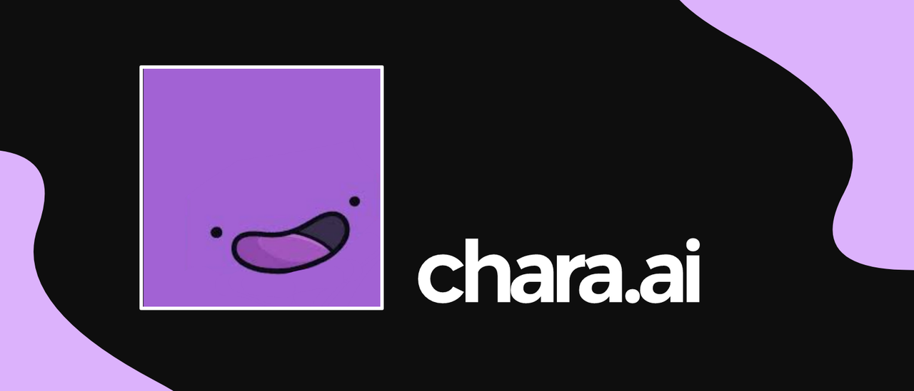

# chara.ai

**Documentação de referência para usuários do BOT chara.ai, trazendo os seus personagens preferidos para a palma da sua mão.**

---

As seguintes funcionialidades estão disponíveis:

- *Falar com personagens diferentes personagens disponível na plataforma character.ai.*
- *Pesquisar por personagens.*

## Sumário

- [Configuração inicial](#configuração-inicial)
- [Keys](#keys)
  - [Comandos para gerenciar keys](#comandos-com-as-keys)
- [Comandos](#comandos-principais)
- [Como adquirir esse BOT](#como-adquirir)
- [Contato](#contato)

## Configuração inicial

Requisitos:

- Uma *key* para ativar o bot.
- O *link* de convite para o bot.

Se você tem todos esses requisitos, por favor siga os seguintes passos **na ordem:**

- Configure a key:
  1.  Convide o BOT para seu servidor usando o link de convite.
  2.  Use o comando `/activate` junto com sua key para ativar o BOT. Se você digitou corretamente, o BOT alertará que a key foi ativada com sucesso.
  > Exemplo: `/activate "7Z8V-LIFO-2W5T"`
  3.  Use o comando `/expires` para checar quando sua key vai expirar. Esse comando pode ser usado a qualquer momento para te deixar informado.
  4. Pronto! O BOT já está configurado e pode ser usado. Confira todos os comandos disponíveis na seção [comandos](#comandos-principais).
  5. Em caso de dúvidas, por favor leia mais informações sobre as keys na seção [abaixo](#keys).

- Configure um canal para usar o BOT:
  1. Crie um canal com o nome do personagem. Como existem variedades de personagens com o mesmo nome no site, o BOT irá entender que você quer iniciar um chat com o personagem mais usado no site.
  > [!IMPORTANT]
  > Caso o nome do personagem esteja errado ou não exista, o BOT irá alertar que não existe um personagem com o nome especificado no canal.
  2. Alternativamente, é possível que você queira conversar uma versão específica de um personagem. Isso pode ser feito usando o comando `/setup`, onde você pode pesquisar por um personagem e vincular ele ao canal. Veja mais detalhes em [comandos](#comandos-principais)

## Keys

> [!IMPORTANT]
> Keys são usadas para a ativação da aplicação. Confira a seguir informações essenciais sobre as keys:
- Você deve usar apenas uma key e **uma vez** por mês. Se você tem 2 ou mais keys, aguarde até 1 dia antes da data de expiração da key para usar uma nova. Se você usar uma key e em seguida usar outra, isso não extenderá o prazo de expiração.
- Uma key funciona só uma vez. Se você tentar usar uma key usada, você vai receber uma mensagem alertando que a key não pôde ser usada para ativar o BOT.
- Nenhum comando ou interação com o bot será possível se o BOT não estiver ativado com a key.

### Comandos com as keys

---

#### ⚙️ /activate - `key` 
Ativa o bot com uma key.

- `key` - A key que deve ser usada para que o bot seja ativado.

> Exemplo: `/activate "7Z8V-LIFO-2W5T"`

---

#### ⚙️ /expires 
Checa a data de expiração da key.

Esse comando não tem parâmetros.

---

## Comandos principais

#### ⚙️ /chat - `prompt`
Envia uma mensagem para o personagem, e recebe uma resposta no chat.

- `prompt` - A mensagem que deve ser enviada ao bot.

> Exemplo: `/chat "bom dia, thanos!"`

## Como adquirir

**Você pode adquirir este BOT oficialmente no nosso [canal oficial do Discord.](https://discord.gg/M7FURN5R88) Você também encontra atualizações e poderá entrar em contato com o suporte.**

## Contato

🚀 **Esse BOT foi desenvolvido com carinho por Miguel, desenvolvedor full stack.**

Todos os links de contato estão abaixo. Vem trocar uma ideia comigo! 🖖

- **Email: miguelup01@outlook.com**
- **Servidor: [HyperStore](https://discord.gg/M7FURN5R88)**
- **Discord: miguelnto**
